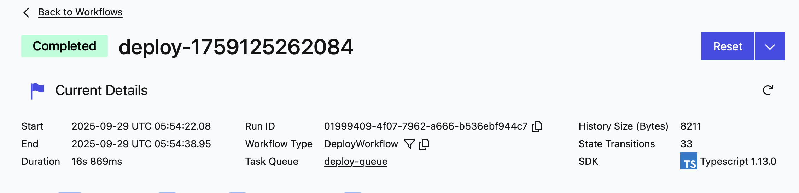
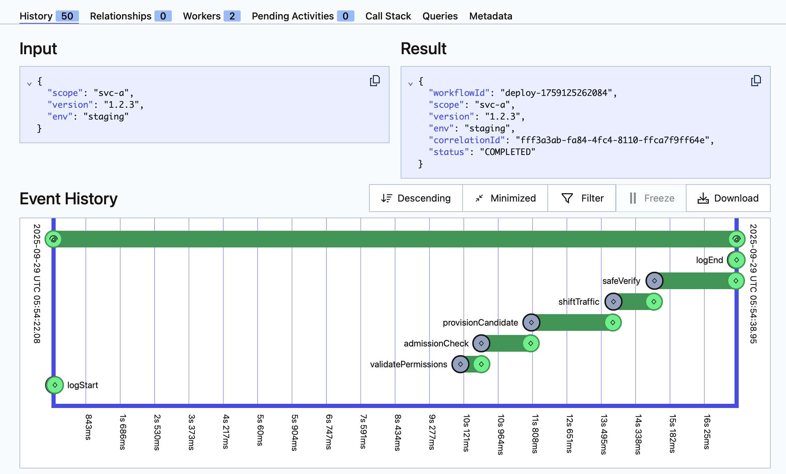
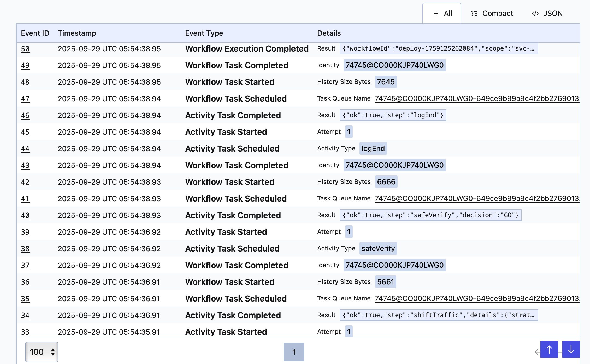
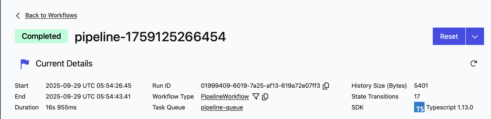
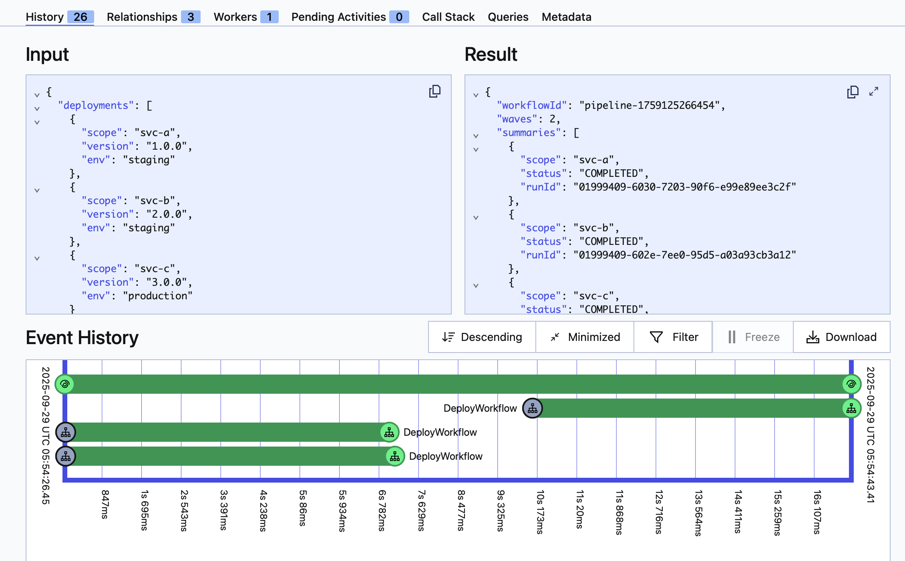
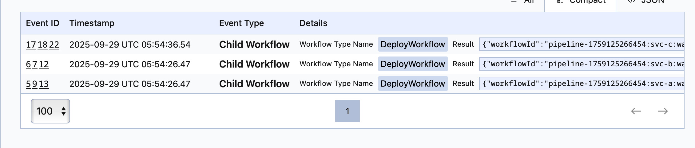

# Ejemplos de Ejecución - Temporal Deploy Pipeline PoC

Este documento muestra ejemplos reales de ejecución de los workflows y cómo interpretar los resultados.

## 🚀 Deploy Individual

### Comando:
```bash
npm run run:deploy
```

### Salida esperada:
```
> poc-temporal@1.0.0 run:deploy
> bash scripts/run-deploy.sh

DeployWorkflow started {
  workflowId: 'deploy-1759124865788',
  runId: '01999403-42ff-78f1-aa70-f51c3b3b7c78'
}
{
  "workflowId": "deploy-1759124865788",
  "runId": "01999403-42ff-78f1-aa70-f51c3b3b7c78"
}
```

### Interpretación:
- **workflowId**: Identificador único del workflow (`deploy-1759124865788`)
- **runId**: Identificador único de esta ejecución específica
- El workflow ejecuta las siguientes actividades secuencialmente:
  1. `logStart` - Registra el inicio del deploy
  2. `validatePermissions` - Valida permisos del usuario
  3. `admissionCheck` - Verifica admisión del deploy
  4. `provisionCandidate` - Provisiona el candidato
  5. `shiftTraffic` - Cambia el tráfico (estrategia BLUE_GREEN)
  6. `safeVerify` - Verifica que el deploy sea seguro
  7. `logEnd` - Registra el final del deploy

## 🔄 Pipeline con Waves

### Comando:
```bash
npm run run:pipeline
```

### Salida esperada:
```
> poc-temporal@1.0.0 run:pipeline
> bash scripts/run-pipeline.sh

PipelineWorkflow started {
  workflowId: 'pipeline-1759124869798',
  runId: '01999403-52a9-73bd-964a-c8dd34611540'
}
{
  "workflowId": "pipeline-1759124869798",
  "runId": "01999403-52a9-73bd-964a-c8dd34611540"
}
```

### Interpretación:
- **workflowId**: Identificador del workflow padre (`pipeline-1759124869798`)
- **runId**: Identificador de esta ejecución específica
- El pipeline ejecuta dos waves:
  - **Wave 1**: Deploy de `svc-a` y `svc-b` en paralelo
  - **Wave 2**: Deploy de `svc-c` después de que Wave 1 complete

## 📊 Monitoreo en Temporal UI

### Acceso:
- URL: http://localhost:8233/
- Interfaz web para monitorear workflows en tiempo real

### 1. Dashboard Principal

*Pantalla principal del UI de Temporal mostrando métricas generales del sistema*

### 2. Detalles de DeployWorkflow




*Vista detallada de un DeployWorkflow mostrando:*
- Estado actual (Running, Completed, Failed)
- Historial de actividades secuenciales
- Logs detallados de cada actividad
- Tiempo de ejecución y métricas

### 3. Detalles de PipelineWorkflow



*Vista detallada de un PipelineWorkflow mostrando:*
- Orquestación de múltiples deploys
- Child workflows ejecutados en paralelo
- Waves de despliegue
- Estado de cada workflow hijo

### Características del UI:
1. **Lista de Workflows**: Ver todos los workflows ejecutados
2. **Detalles del Workflow**: 
   - Estado actual (Running, Completed, Failed)
   - Historial de actividades
   - Logs detallados
   - Tiempo de ejecución
3. **Child Workflows**: Ver workflows hijos del pipeline
4. **Métricas**: Tiempo de ejecución, reintentos, etc.

### Navegación típica:
1. Abrir http://localhost:8233/
2. Ir a "Workflows" en el menú lateral
3. Buscar por workflowId o filtrar por tipo
4. Hacer clic en un workflow para ver detalles
5. Revisar la pestaña "History" para ver actividades
6. Revisar la pestaña "Logs" para ver output detallado

## 🔍 Verificación de Estado

### Comando para verificar estado:
```bash
npm run status -- <workflowId>
```

### Ejemplo:
```bash
npm run status -- deploy-1759124865788
```

### Salida esperada:
```
WorkflowId: deploy-1759124865788
RunId: 01999403-42ff-78f1-aa70-f51c3b3b7c78
Status: COMPLETED
StartTime: 2024-01-29T12:43:45.788Z
EndTime: 2024-01-29T12:43:47.123Z
```

## 📈 Logs de Workers

### Workers ejecutándose:
```
Deploy worker listening on task queue deploy-queue
Pipeline worker listening on task queue pipeline-queue
```

### Logs durante ejecución:
```
[INFO] DeployWorkflow started for scope: svc-a, version: 1.2.3, env: staging
[INFO] Executing logStart activity
[INFO] Executing validatePermissions activity
[INFO] Executing admissionCheck activity
[INFO] Executing provisionCandidate activity
[INFO] Executing shiftTraffic activity with strategy: BLUE_GREEN
[INFO] Executing safeVerify activity
[INFO] DeployWorkflow completed successfully
```

## 🎯 Casos de Uso

### 1. Deploy Individual
- **Cuándo usar**: Deploy de un solo servicio
- **Ventajas**: Control granular, fácil debugging
- **Tiempo estimado**: 2-5 segundos

### 2. Pipeline con Waves
- **Cuándo usar**: Deploy de múltiples servicios con dependencias
- **Ventajas**: Orquestación compleja, paralelización controlada
- **Tiempo estimado**: 5-10 segundos (depende del número de waves)

### 3. Pipeline con Aprobación Manual
- **Cuándo usar**: Deploys críticos que requieren revisión humana
- **Ventajas**: Control de calidad, gates de seguridad
- **Tiempo estimado**: Variable (depende de la aprobación)

## 🚨 Manejo de Errores

### Error en Deploy Individual:
- Si `safeVerify` retorna decisión diferente a `GO`
- Se ejecuta automáticamente `rollback`
- El workflow falla con error descriptivo

### Error en Pipeline:
- **failPolicy: 'fail-fast'**: Se detiene inmediatamente
- **failPolicy: 'wait-all'**: Continúa con otros deploys
- Se registran todos los errores para análisis posterior

## 📋 Checklist de Verificación

- [ ] Servidor Temporal ejecutándose (puerto 7233)
- [ ] Workers ejecutándose (deploy-queue y pipeline-queue)
- [ ] UI accesible en http://localhost:8233/
- [ ] Comando `npm run run:deploy` funciona
- [ ] Comando `npm run run:pipeline` funciona
- [ ] Workflows aparecen en el UI
- [ ] Logs muestran actividades ejecutándose
- [ ] Workflows completan con estado COMPLETED

