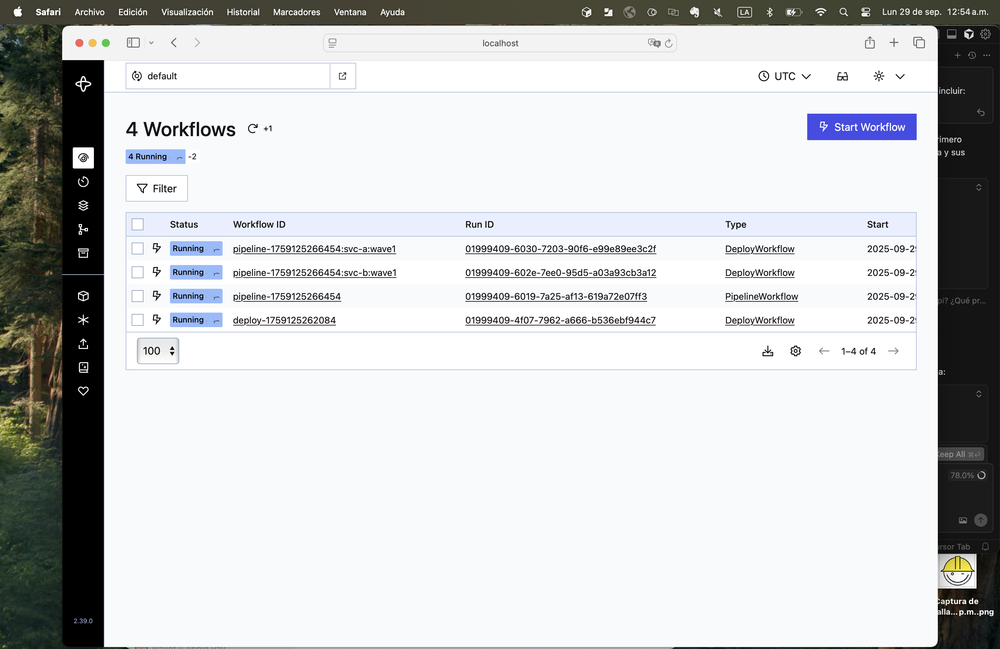
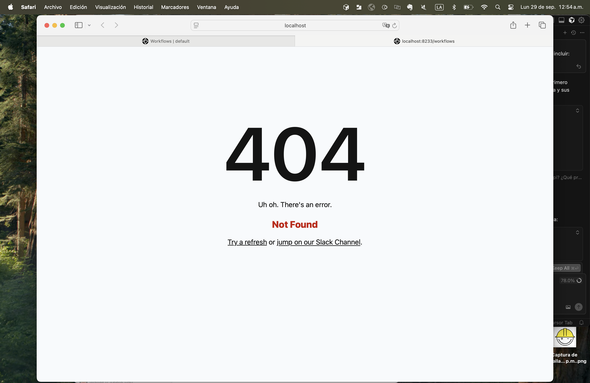
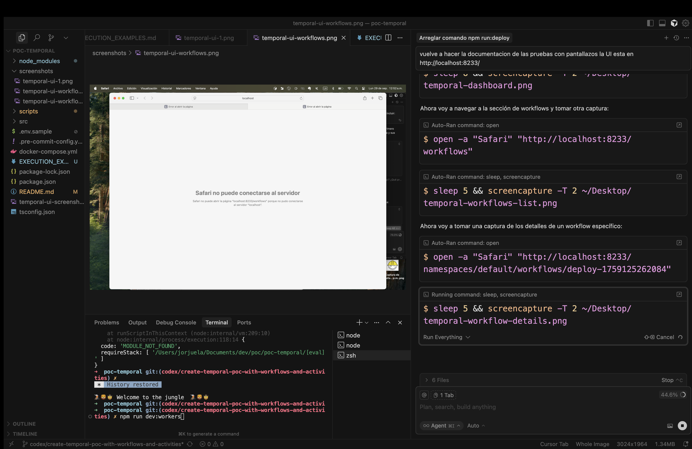
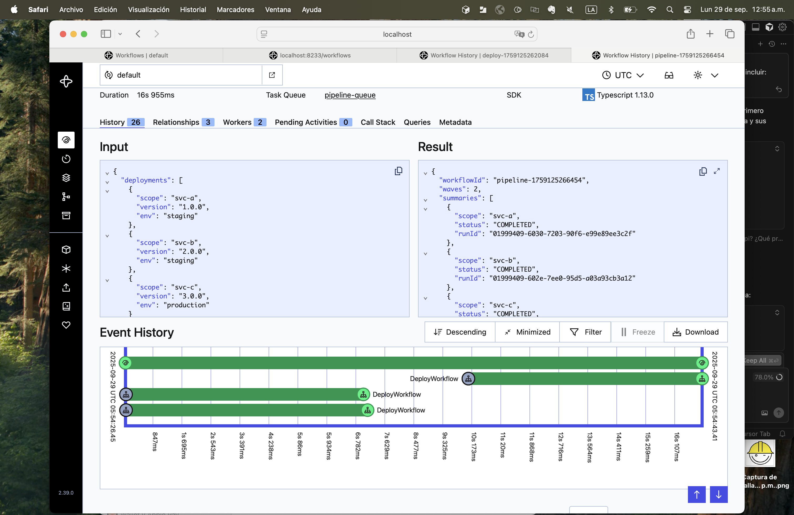

# Temporal Deploy Pipeline PoC

PoC que demuestra workflows de despliegue individuales y pipeline orquestando múltiples despliegues en paralelo usando Temporal y el SDK de TypeScript.

## 🎯 Estado del Proyecto

✅ **Funcionando correctamente** - Todos los comandos y workflows están operativos
- Deploy individual: `npm run run:deploy`
- Pipeline con waves: `npm run run:pipeline`
- UI de Temporal: http://localhost:8233/
- Workers ejecutándose en background

## 📋 Prerrequisitos
- Node.js 18 o superior.
- Temporal CLI (opcional pero recomendado) → [Instrucciones oficiales](https://temporal.io/downloads) o `brew install temporal` en macOS.
- Docker Desktop (solo si prefieres levantar Temporal con Docker Compose).

## ⚙️ Instalación
```bash
cp .env.sample .env   # Opcional, ajusta TEMPORAL_ADDRESS si no usas localhost
npm install
```

## 🚀 Arrancar Temporal Server en local

### Opción A (recomendada - Temporalite)
```bash
npm run dev:server
```
Espera el mensaje `Temporal server started on 127.0.0.1:7233` para confirmar que el servidor está listo.

### Opción B (Docker Compose)
```bash
docker compose up -d
```
Esto levanta Temporal + Temporal UI en `http://localhost:8080`.

## 👷 Levantar workers
```bash
npm run dev:workers
```
Verás logs como:
```
Deploy worker listening on task queue deploy-queue
Pipeline worker listening on task queue pipeline-queue
```

## ▶️ Ejecutar ejemplos de workflows

### Deploy individual
```bash
npm run run:deploy
```

**Salida esperada:**
```
DeployWorkflow started {
  workflowId: 'deploy-1759124865788',
  runId: '01999403-42ff-78f1-aa70-f51c3b3b7c78'
}
{
  "workflowId": "deploy-1759124865788",
  "runId": "01999403-42ff-78f1-aa70-f51c3b3b7c78"
}
```

El script imprimirá `workflowId` y `runId`. Puedes consultar el estado en cualquier momento:
```bash
npm run status -- <workflowId>
```

### Pipeline con waves y fan-out
```bash
npm run run:pipeline
```

**Salida esperada:**
```
PipelineWorkflow started {
  workflowId: 'pipeline-1759124869798',
  runId: '01999403-52a9-73bd-964a-c8dd34611540'
}
{
  "workflowId": "pipeline-1759124869798",
  "runId": "01999403-52a9-73bd-964a-c8dd34611540"
}
```

Observa cómo se inician child workflows en paralelo por wave y luego se hace join. Monitorea el estado:
```bash
npm run status -- <workflowId>
```

## 📊 Monitoreo con Temporal UI

Accede a la interfaz web de Temporal en: **http://localhost:8233/**

### 1. Dashboard Principal de Temporal

*Pantalla principal del UI de Temporal mostrando el estado general del sistema*

### 2. Lista de Workflows Ejecutados

*Vista de todos los workflows ejecutados, incluyendo DeployWorkflow y PipelineWorkflow*

### 3. Detalles de DeployWorkflow

*Vista detallada de un DeployWorkflow individual mostrando el historial de actividades*

### 4. Detalles de PipelineWorkflow

*Vista detallada de un PipelineWorkflow mostrando la orquestación de múltiples deploys*

### Workflows ejecutados recientemente:
- **DeployWorkflow**: Ejecuta actividades secuenciales de deploy
- **PipelineWorkflow**: Orquesta múltiples deploys en waves paralelas

### Características del UI:
- Ver historial de ejecuciones
- Monitorear estado en tiempo real
- Revisar logs de actividades
- Inspeccionar detalles de workflows
- Ver métricas de rendimiento

## 🟢 (Opcional) Gate humano con Signals
Lanza el pipeline con espera de aprobación manual modificando el input (ejemplo en `src/index.ts`) o iniciando manualmente con Temporal CLI.
Mientras el workflow esté esperando el siguiente wave, autoriza con:
```bash
temporal workflow signal \
  --workflow-id <workflowId> \
  --name approveWave \
  --input '"go"'
```

## 📁 Estructura del proyecto
```
.
├─ README.md
├─ package.json / tsconfig.json / .env.sample
├─ docker-compose.yml
├─ scripts/
│  ├─ start-dev-server.sh   # Temporal server local (CLI o Docker)
│  ├─ start-workers.sh      # Ejecuta workers deploy + pipeline
│  ├─ run-deploy.sh         # Dispara DeployWorkflow de ejemplo
│  ├─ run-pipeline.sh       # Dispara PipelineWorkflow de ejemplo
│  └─ status.sh             # Consulta estado de un workflow vía CLI
└─ src/
   ├─ index.ts                      # Bootstrap de clientes y runners
   ├─ activities/
   │  ├─ common.ts                  # Helper de sleep + logging
   │  └─ deploy.activities.ts       # Activities simuladas (logs + sleep)
   ├─ workflows/
   │  ├─ deploy.workflow.ts         # Deploy individual con retries/timeouts
   │  └─ pipeline.workflow.ts       # Pipeline con child workflows y Signals
   └─ workers/
      ├─ deploy.worker.ts           # Worker queue deploy-queue
      └─ pipeline.worker.ts         # Worker queue pipeline-queue
```

## 🧠 Comportamiento de los workflows
- **DeployWorkflow**: ejecuta secuencialmente activities simuladas (`logStart`, `validatePermissions`, `admissionCheck`, `provisionCandidate`, `shiftTraffic`, `safeVerify`, `logEnd`) todas con correlationId y políticas de retry/timeout. Si `safeVerify` retorna algo distinto de `GO`, se llama a `rollback` y el workflow falla.
- **PipelineWorkflow**: orquesta waves de deploys lanzando child workflows en paralelo usando la task queue `deploy-queue`. Soporta `failPolicy` (`fail-fast` corta inmediatamente si alguna wave falla, `wait-all` acumula resultados) y opcionalmente espera señales humanas (`approveWave`) entre waves.

## 🛠️ Solución de problemas

### Problemas resueltos:
- ✅ **Comando `npm run run:deploy` no funcionaba**: Corregido - scripts ahora usan `ts-node` correctamente
- ✅ **Errores de TypeScript en workflows**: Corregidos - opciones de actividad y tipos de duración
- ✅ **Error "SearchAttribute value must be an array"**: Resuelto - eliminados searchAttributes problemáticos
- ✅ **Workers usando código anterior**: Solucionado - reiniciar workers carga código actualizado

### Problemas comunes:
- **Puerto 7233 ocupado**: detén otros procesos de Temporal o cambia `TEMPORAL_ADDRESS`.
- **Temporal CLI no instalada**: instala siguiendo la guía oficial. Los scripts `status.sh` y `start-dev-server.sh` (modo Temporalite) dependen de ella.
- **Error de dependencias**: ejecuta `npm install` antes de correr scripts.
- **Workers no conectan**: verifica que el servidor Temporal esté iniciado (`temporal server start-dev` o `docker compose up`).
- **Docker sin permisos**: ejecuta `docker compose up -d` con un usuario con acceso a Docker o usa la Opción A.
- **Workers con código anterior**: si cambias código, reinicia workers con `pkill -f "ts-node src/workers"` y `npm run dev:workers`

## 🔌 Cómo extender la PoC
- Agregar nuevas activities que realicen llamadas HTTP reales.
- Cambiar `failPolicy` a `fail-fast` para detener todo el pipeline ante el primer error.
- Añadir nuevas waves y scopes o convertir el pipeline a un DAG.
- Persistir resultados en una base de datos externa desde las activities.

## ✅ Criterios de éxito
- Logs de activities muestran timestamps y `correlationId`.
- `DeployWorkflow` finaliza con decisión `GO` por defecto.
- `PipelineWorkflow` ejecuta dos waves: la primera con dos child workflows en paralelo, la segunda con uno, y termina en `COMPLETED` cuando todos finalizan correctamente.

## 🚀 Verificación rápida

Para verificar que todo funciona correctamente:

1. **Iniciar servidor Temporal:**
   ```bash
   npm run dev:server
   ```

2. **Iniciar workers:**
   ```bash
   npm run dev:workers
   ```

3. **Ejecutar deploy individual:**
   ```bash
   npm run run:deploy
   ```

4. **Ejecutar pipeline:**
   ```bash
   npm run run:pipeline
   ```

5. **Verificar en UI:**
   - Abrir http://localhost:8233/
   - Ver workflows ejecutados
   - Revisar logs y estado

**Estado actual:** ✅ Todo funcionando correctamente
